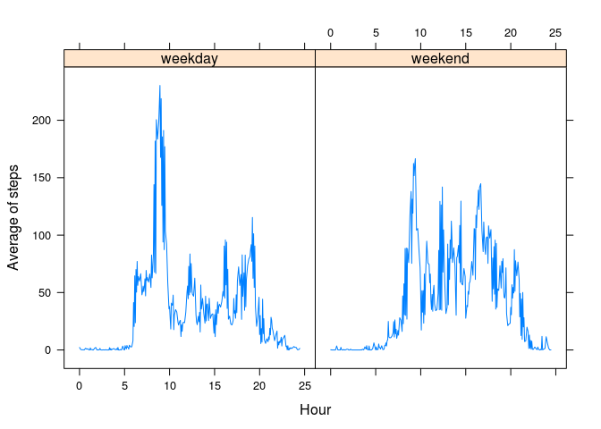

# Reproducible Research: Peer Assessment 1


## Loading and preprocessing the data

I'm loading directly tcleahe zip file, for this purpose I 


```r
	data  <- read.csv(unzip("activity.zip", "activity.csv"))
```

The field *date* is a factor. I convert this field to the proper type:


```r
	data$date  <- as.Date(data$date, format = "%Y-%m-%d")
```

I'm adding a new field *hour* geting it from interval:

```r
	data$hour  <- data$interval /100 + (data$interval %% 100) /60
```

Now, it's good to have a general ideas:


```r
	summary(data)
```

```
##      steps             date               interval           hour      
##  Min.   :  0.00   Min.   :2012-10-01   Min.   :   0.0   Min.   : 0.00  
##  1st Qu.:  0.00   1st Qu.:2012-10-16   1st Qu.: 588.8   1st Qu.: 6.25  
##  Median :  0.00   Median :2012-10-31   Median :1177.5   Median :12.23  
##  Mean   : 37.38   Mean   :2012-10-31   Mean   :1177.5   Mean   :12.23  
##  3rd Qu.: 12.00   3rd Qu.:2012-11-15   3rd Qu.:1766.2   3rd Qu.:18.22  
##  Max.   :806.00   Max.   :2012-11-30   Max.   :2355.0   Max.   :24.47  
##  NA's   :2304
```


## What is mean total number of steps taken per day?

We calculate the number of steps per day, with the use of function aggregate:


```r
	stepsPerDay  <-  aggregate(data$steps, by = list( data$date), FUN = sum)
	names(stepsPerDay)  <-  c("date", "steps")
```

And here you have the histogram:


```r
	hist(stepsPerDay$steps, xlab = "Number of steps per day", main = "Histogram of steps per day")
```

 

The media of steps per day is 10766.19 and the median is 10765.


## What is the average daily activity pattern?

I create a new data frame called *stepsPerInterval* where I calculate the mean of steps along all days. Notice that I've removed NAs. Otherwise the mean should not be calculated:


```r
	stepsPerInterval  <-  aggregate(data$steps, by = list( data$hour), FUN = mean, na.rm = TRUE)
	names(stepsPerInterval)  <- c("hour", "steps")
```

And then I find the hour where the average number of steps is maximun:

```r
	maxSteps  <- max(stepsPerInterval$steps)
	maxSteps
```

```
## [1] 206.1698
```

```r
	stepsPerInterval[stepsPerInterval$steps == maxSteps,"hour"]
```

```
## [1] 8.933333
```
Then, I plot the results:

```r
	plot(stepsPerInterval$hour, stepsPerInterval$steps, type = "l", xlim = c(0, 24), main = "Average of steps by hour", xlab = "Hour", ylab = "Average of # steps")
```

 

## Imputing missing values

1. We don't have information on 2304 records about *steps*.

2. We're creating a new data frame without the NAs. The strategy is filling it with the average for this interval.


```r
	cleanData <- data
	for (i in 1:nrow(cleanData)){
		if (is.na(cleanData[i, "steps"])) {
			cleanData[i,"steps"]  <- stepsPerInterval[stepsPerInterval$hour == cleanData[i, "hour"], "steps"]
		}
	}
```

3. I recalculate *stepsPerDay*:

```r
	stepsPerDay  <-  aggregate(cleanData$steps, by = list( cleanData$date), FUN = sum)
	names(stepsPerDay)  <-  c("date", "steps")
```
4. And here you have the new histogram


```r
	hist(stepsPerDay$steps, xlab = "Number of steps per day", main = "Histogram of steps per day(NAs filled)")
```

 

The number of values rounding average has increased.

## Are there differences in activity patterns between weekdays and weekends?

We introduce to the dataframe *cleanData* a new field called *weekday*. It could be a working day (Mon, Tues, Wed, Thur, Fri) or a weekend (Sat, Sun):


```r
	wday  <- factor(weekdays(cleanData$date, abbreviate = TRUE)=="dom" | weekdays(cleanData$date, abbreviate = TRUE)=="sáb", levels = c(FALSE, TRUE), labels = c("weekday", "weekend"))
	cleanData["weekday"]  <- wday
```

Recalculate activity for weekdays & weekends:

```r
	stepsPerInterval  <-  aggregate(cleanData$steps, by = list( cleanData$hour, cleanData$weekday), FUN = mean, na.rm = TRUE)
	names(stepsPerInterval)  <- c("hour", "weekday", "steps")
```

And ploting results:

```r
	library(lattice)
	xyplot(stepsPerInterval$steps~stepsPerInterval$hour|stepsPerInterval$weekday, xlab="Hour", ylab="Average of steps", type = "l")
```

 

